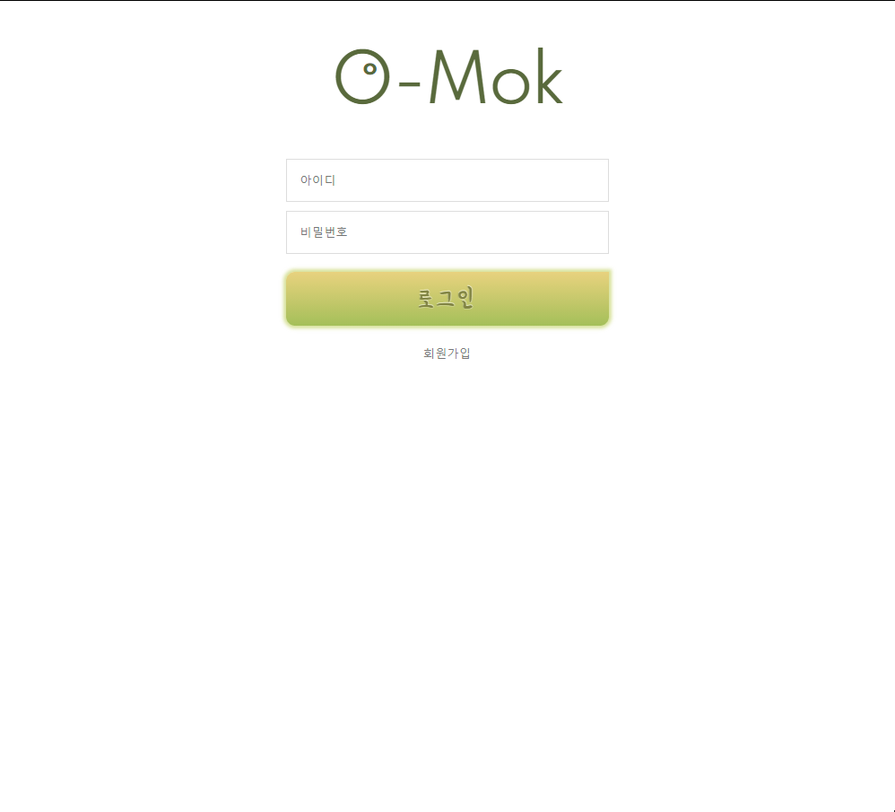
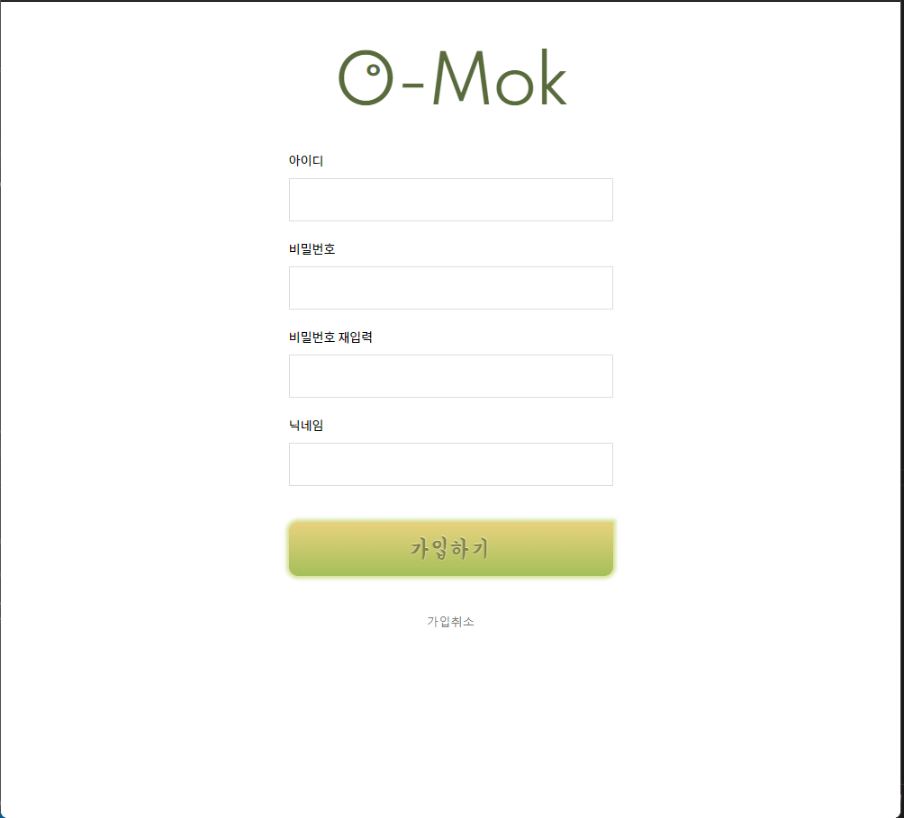
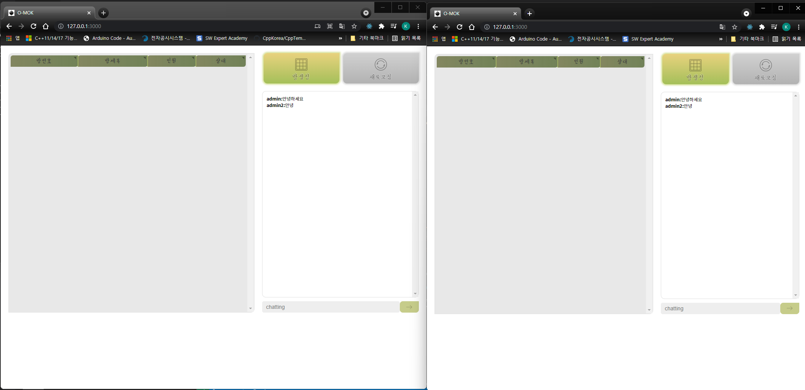
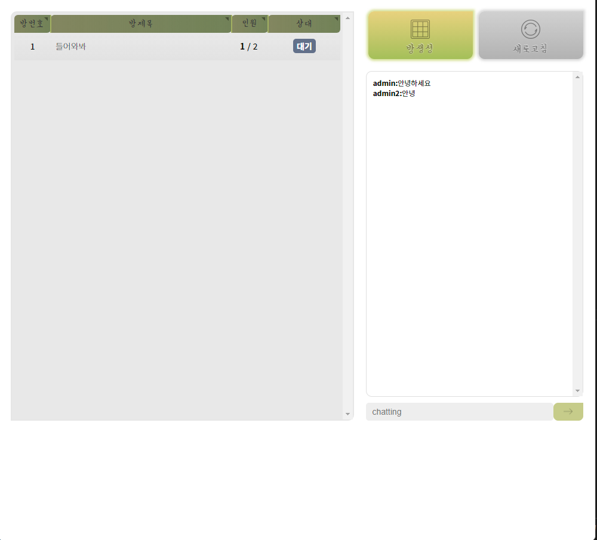
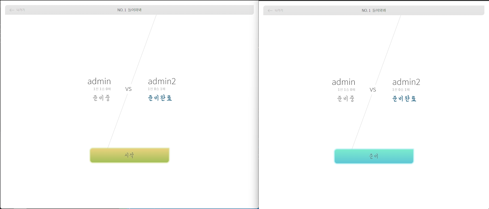
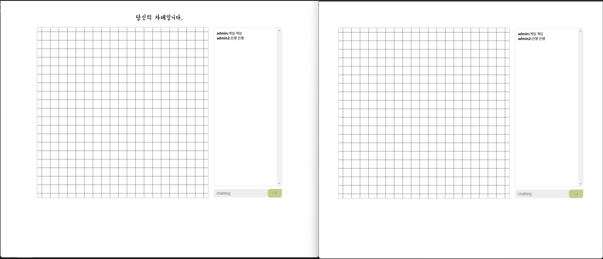
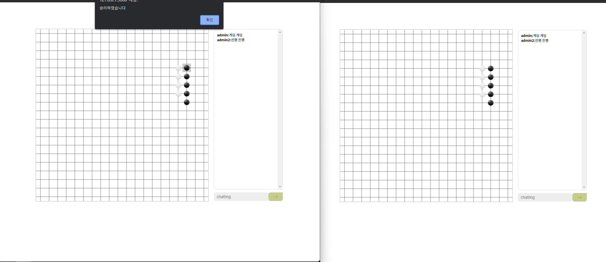

# Gomoku(오목)


## how  to Run?

```bash
#front build:
cd omok
react-scripts build

#server start:
cd omokServer
npm start
```


---

## Skills

FE: , 

BE: , , 


---

## Collaborator

design: [최송은](https://github.com/ostrichtofu)

programming: [김기현](https://github.com/kiheyunkim)


------

## feature

> 1. 랭킹 기능
>    * 승, 패를 기록하고 사용자에 대한 기록을 DB에 유지합니다.
> 2. 채팅 기능
>    * 대기실, 게임중에도 언제든지 채팅이 가능합니다.
> 3. 예외 사항에 대한 방어
>    * 다른 사용자가 방에 들어왔으나 갑자기 나가는 경우에 대한 예외 처리가 되어있습니다.
>    * 게임 중에 갑자기 나가는 경우의 예외처리가 되어있습니다.
> 4. socket.io의 네임 스페이스 기능을 통한 방의 분리
>    * 사용자들은 각자의 방에서 서로 간에만 채팅을 하고 게임을 진행할 수 있습니다.
>    * 네임 스페이스가 쉬운경우 누구나 간파하여 접속할 수 있으므로 SHA-256을 통해 무작위의 네임스페이스 값(방 고윳값)을 생성 합니다.
> 5. Javascript의 프로퍼티 동적 생성을 통한 정보 저장
>    * 각 유저(플레이어)의 정보는 서버에 접속된 개별의 소켓에 프로퍼티 동적 생성을 통해 저장되며 접속 해제시 사라집니다.
>    * 반드시 유지되어야할 정보는 DB에 저장되므로 유실되지 않습니다.
> 6. 중복 접속 방지
>    * 접속한 사용자의 정보는 DB에 저장해서 중복 접속을 방지합니다.


---

## ScreenShot
















---

## DB Scheme

```mysql
CREATE DATABASE IF NOT EXISTS omok;

USE omok;

CREATE TABLE IF NOT EXISTS user(
    id varchar(30) NOT NULL,
    passwd varchar(256) NOT NULL,
    nickname varchar(30) NOT NULL,
    PRIMARY KEY (nickname)
);

CREATE TABLE IF NOT EXISTS statistic (
    nickname varchar(30) NOT NULL,
    win int DEFAULT 0,
    lose int DEFAULT 0,
    PRIMARY KEY (nickname),
    FOREIGN KEY (nickname) REFERENCES user(nickname)
);

CREATE TABLE IF NOT EXISTS preventOverlapLogin(
    nickname varchar(30) NOT NULL,
    PRIMARY KEY (nickname),
    FOREIGN KEY (nickname) REFERENCES user(nickname)
);

```


---

## known issue

1. 게임 중에 상대방이 무기한 대기하는 경우에 대한 방어는 되어있지 않습니다.


---

## License

